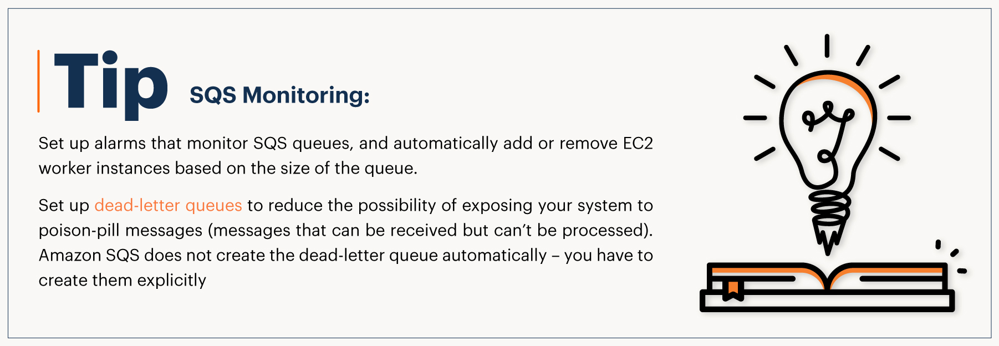

## AWS SQS – Simple Queue Service - Expert - Usecases

- Amazon SQS is a fully managed event-queuing service that enables you to decouple and scale microservices and serverless applications.

- Using SQS, you can send, store, and receive messages between software components at any volume, without losing messages or requiring other services to be available. If no workers pull jobs from SQS, the messages stay in the queue.

- SQS offers two types of event queues. Standard queues offer maximum throughput, with best-effort ordering and at-least-once delivery. SQS FIFO queues offer event processing in the exact order that events are sent, with exactly once processing guarantee, although it comes with a throughput constraint.

## Use Case 1 :
