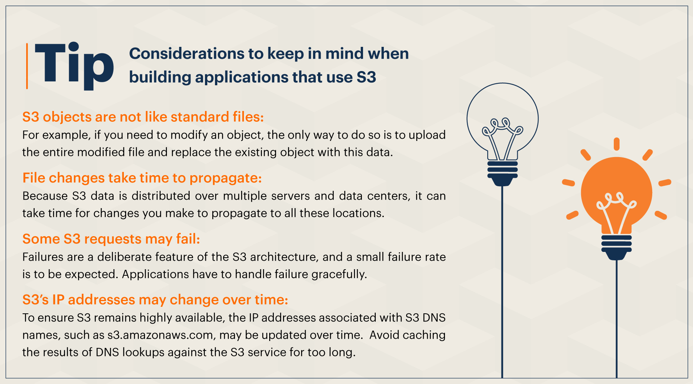

## AWS S3 – Simple Storage Service - Beginner Usecases

- Amazon S3 or Amazon Simple Storage Service is a service that provides is cloud-based persistent storage through a web service interface. It’s built to store, protect and retrieve data from “buckets” at any time, from anywhere, on any device.

- Amazon S3 is a simple key-based object-store. It enables you to simply put data in the cloud and pull it back out through standard REST- and SOAP-based web service APIs. You are shielded from the details of how it is stored or where it is actually stored. When you store data, you assign a unique object key that can later be used to retrieve the data. Keys can be any string, and they can be constructed to mimic hierarchical attributes. Alternatively, you can use S3 Object Tagging to organize your data across all of your S3 buckets and/or prefixes.

- Using this service, you can easily build applications that make use of cloud native storage. S3 gives you access to the same scalable, reliable, secure and inexpensive infrastructure that Amazon uses to run its own global network of websites. Since S3 is highly scalable and you only pay for what you use, you can start small and grow your application as you wish, with no compromise on performance or reliability.

- While designed for developers for easier web-scale computing, it provides 99.99999% durability and 99.99% availability of objects. The popularity of S3 also can be attributed to its cost-effectiveness.

## Use Case 1 :
